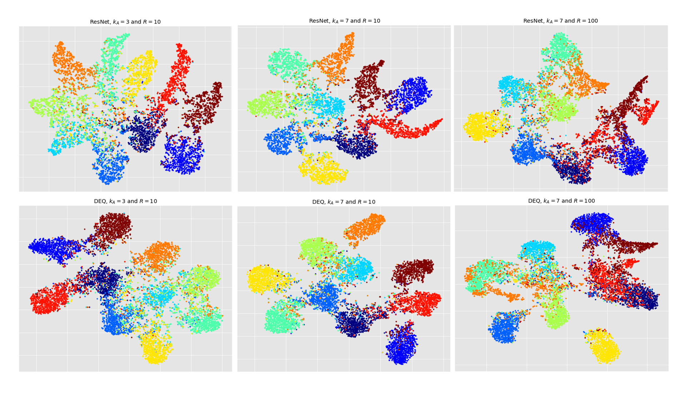

### 1. log plots
We have updated the y-axis of $\mathcal{NC}$ to be logarithmic, and the plot is shown below:

 

### 2. More figures

In comparing the performance of Explicit NN and DEQ, We compare the cases of $R=10$ under $k_A=3$ and $k_A=7$ to demonstrate the impact of the number of majority classes. As the accuracy of the minority classes mostly drops to zero when $R=100$, we only consider the case of $k_A=7$ as representative.

* t-SNE

We found that the clusters formed by ResNet are elongated, while those formed by DEQ are circular. The distances between the same classes in DEQ are smaller, and the boundaries of DEQ are slightly clearer, with distances between classes relatively farther apart.
 

Specifically, in the case of $R=100$, it fails to distinguish the boundaries between minority classes. All three minority classes are merged with the majority class, which further validates our proposition 4.2.

* Gram matrix $W^TW$

Similarly, in imbalanced scenarios, DEQ extracts minority class features relatively better compared to explicit NN. We believe this is mainly because, under fixed-point iteration, it allows the samples to undergo multiple learning iterations.

* Gram matrix $H^TH$
 

In balanced scenarios, there is not much difference between the results of DEQ and ResNet; therefore, we did not present them here.